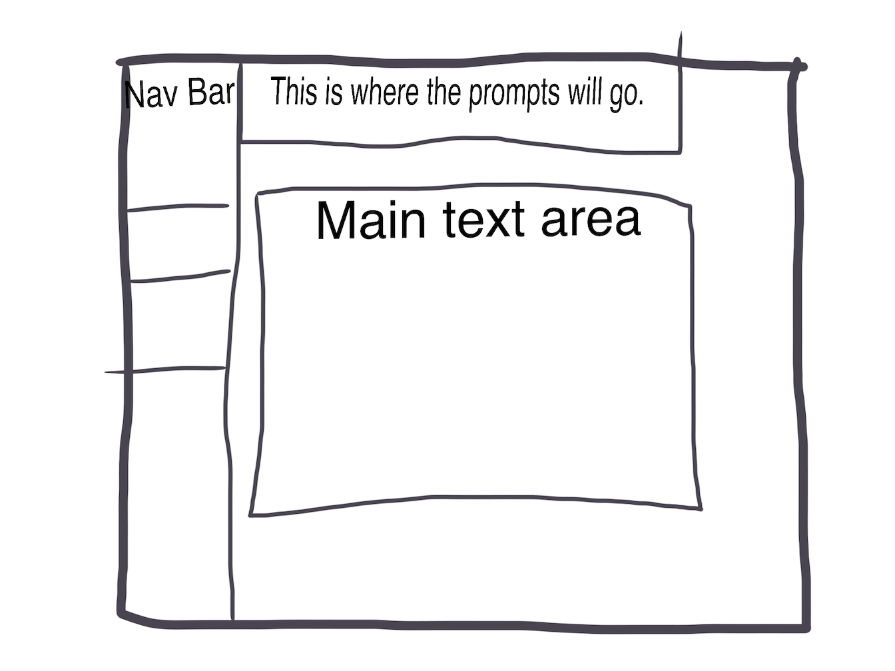

# A Journal That Can Be Considred Alive
###### title work in progress

#### A Journaling App

### by Sean Downs

# 2020-10-02 NOTE
A lot of learning was had today. I kept a log at https://github.com/SPdowns/CaseoftheFridays-Part2 but wasn't sure if I should post 2 links in the submission page on Epicenter.

## Description

This application is intended to *not only* help you become a better journaler, but it is also intended to help you practice mindfullness in a positive, creative space while cultivating a habit ritual that can carry into every part of a developing workflow.

### Capstone Proposal
The link for my Capstone Proposal is https://drive.google.com/file/d/1_aNFj352-MQWC1UdX5tpkXVArf_p9LUv/view?usp=sharing

### Specification

These are a prelim list of large goals I can break down further once I read and watch more material.

Goal 1 - Create a a simple design site that has a splash page, a journal list page, a journal entry page, and a journal entry display page.

Goal 2 - Implement the WordPress platform and MySQL db. This is such a summary of what needs to be done I just don't have the specifics of what comes first.

### Setup

This may be viewed at (I'm going to buy a cheap domain and host it on gh-pages and I think I'll explaine the MAMP and cloning process when I have abetter understanding of how to wuickly accomplish that)

### Technologies Used

HTML 5

CSS

PHP

WordPress

### License

*{GNU GENERAL PUBLIC LICENSE
                       Version 3, 29 June 2007

 Copyright (C) 2007 Free Software Foundation, Inc. <https://fsf.org/>
 Everyone is permitted to copy and distribute verbatim copies
 of this license document, but changing it is not allowed.}*

Copyright (c) 2020 **_{Sean Downs}_**
